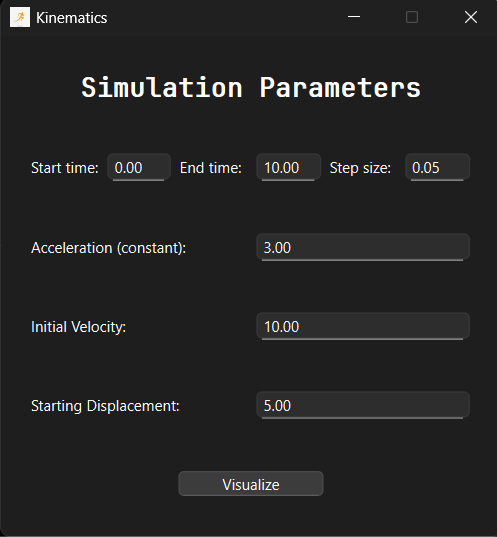
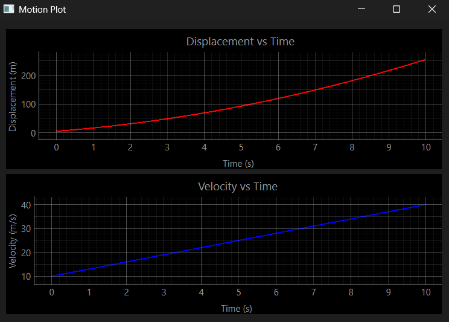

# 📈 Kinematics Visualizer

A PyQt6 and PyQtGraph-based desktop application to visualize motion under constant acceleration. This tool plots **displacement vs. time** and **velocity vs. time** graphs using classical equations of motion for uniformly accelerated motion.

---

## 🧭 Features

- Interactive GUI for simulation input
- Real-time plots of:
  - Displacement vs Time
  - Velocity vs Time
- Parameter customization:
  - Start time, End time, Time step
  - Acceleration (`a`), Initial velocity (`u`), Initial displacement (`x₀`)

---

## 🎯 Use Case

This application is intended for:
- Physics students visualizing motion equations
- Educators demonstrating kinematic concepts
- Developers exploring PyQt6 + PyQtGraph integration

---

## 📸 Screenshots

| Parameter Input | Motion Graphs |
|-----------------|---------------|
|  |  |

---

## 🏗️ Architecture Overview

The GUI is organized into the following modular components:

- `TimeDetails`: Widget for inputting time range and step
- `OtherDetails`: Reusable input component for numeric parameters
- `MotionPlotter`: PyQtGraph widget for plotting motion curves
- `MainWindow`: Main interface controller

Communication between UI and plotting logic is handled using PyQt's signal-slot mechanism.

---

## 📦 Dependencies

Make sure you have the following Python libraries:

- `PyQt6`
- `pyqtgraph`
- `numpy`

Install with:

```bash
pip install PyQt6 pyqtgraph numpy

## 📌 TODO / Improvements

- [ ] Support variable acceleration
- [ ] Export plots as images
- [ ] Save simulation data to CSV
- [ ] Add unit tests